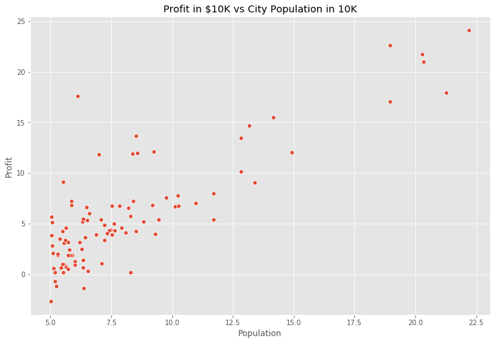
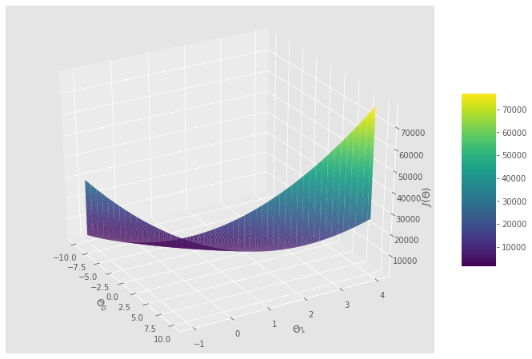
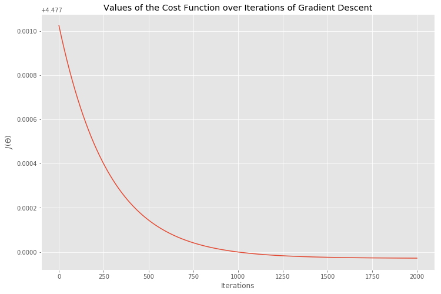
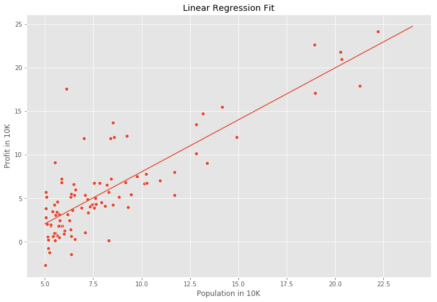

<h2 align="center"> Univariate Linear Regression </h2>

 

### Task 1: Load the Data and Libraries
---


```python
import matplotlib.pyplot as plt 
plt.style.use('ggplot')
%matplotlib inline
```


```python
import numpy as np
import pandas as pd  
import seaborn as sns 
plt.rcParams['figure.figsize'] = (12, 8)
```


```python
data = pd.read_csv('bike_sharing_data.txt')
data.head()
```


<div>
<style scoped>
    .dataframe tbody tr th:only-of-type {
        vertical-align: middle;
    }

    .dataframe tbody tr th {
        vertical-align: top;
    }

    .dataframe thead th {
        text-align: right;
    }
</style>
<table border="1" class="dataframe">
  <thead>
    <tr style="text-align: right;">
      <th></th>
      <th>Population</th>
      <th>Profit</th>
    </tr>
  </thead>
  <tbody>
    <tr>
      <th>0</th>
      <td>6.1101</td>
      <td>17.5920</td>
    </tr>
    <tr>
      <th>1</th>
      <td>5.5277</td>
      <td>9.1302</td>
    </tr>
    <tr>
      <th>2</th>
      <td>8.5186</td>
      <td>13.6620</td>
    </tr>
    <tr>
      <th>3</th>
      <td>7.0032</td>
      <td>11.8540</td>
    </tr>
    <tr>
      <th>4</th>
      <td>5.8598</td>
      <td>6.8233</td>
    </tr>
  </tbody>
</table>
</div>


```python
data.info()
```

    <class 'pandas.core.frame.DataFrame'>
    RangeIndex: 97 entries, 0 to 96
    Data columns (total 2 columns):
    Population    97 non-null float64
    Profit        97 non-null float64
    dtypes: float64(2)
    memory usage: 1.6 KB
    

 

### Task 2: Visualize the Data
---


```python
ax = sns.scatterplot(x='Population', y='Profit', data = data)
ax.set_title("Profit in $10K vs City Population in 10K");
```


    

    


 

 

### Task 3: Compute the Cost $J(\theta)$
---

The objective of linear regression is to minimize the cost function

$$J(\theta) = \frac{1}{2m} \sum_{i=1}^m (h_\theta(x^{(i)}) - y^{(i)} )^2$$

where $h_{\theta}(x)$ is the hypothesis and given by the linear model

$$h_{\theta}(x) = \theta^Tx = \theta_0 + \theta_1x_1$$


```python
def cost_function(X, y, theta):
    m = len(y)
    y_pred = X.dot(theta)
    error = (y_pred - y)**2
    
    return 1/(2*m)*np.sum(error)
```


```python
m = data.Population.values.size
X = np.append(np.ones((m, 1)), data.Population.values.reshape(m,1), axis = 1)
y = data.Profit.values.reshape(m,1)
theta = np.zeros((2,1))

cost_function(X, y, theta)

```


    32.072733877455676


 

### Task 4: Gradient Descent
---

Minimize the cost function $J(\theta)$ by updating the below equation and repeat unitil convergence
        
$\theta_j := \theta_j - \alpha \frac{1}{m} \sum_{i=1}^m (h_{\theta}(x^{(i)}) - y^{(i)})x_j^{(i)}$ (simultaneously update $\theta_j$ for all $j$).


```python
def gradient_descent(X, y, theta, alpha, iterations):
    m = len(y)
    costs = []
    for i in range(iterations):
        y_pred = X.dot(theta)
        error = np.dot(X.transpose(), (y_pred - y))
        theta -=alpha * 1/m * error
        costs.append(cost_function(X, y, theta))
    return theta, costs
    
    
```


```python
theta, costs = gradient_descent(X, y, theta, alpha=0.01, iterations=2000 )
print("h(x) = {} + {}x1".format(str(round(theta[0,0],2)),str(round(theta[1,0],2))))
```

    h(x) = -3.89 + 1.19x1
    


```python

```

### Task 5: Visualising the Cost Function $J(\theta)$
---


```python
from mpl_toolkits.mplot3d import Axes3D
```


```python
theta_0 = np.linspace(-10,10,100)
theta_1 = np.linspace(-1,4,100)

cost_values = np.zeros((len(theta_0),len(theta_1)))

for i in range(len(theta_0)):
    for j in range(len(theta_1)):
        t = np.array([theta_0[i], theta_1[j]])
        cost_values[i, j] = cost_function(X, y , t)
```


```python
fig = plt.figure(figsize = (12, 8))
ax = fig.gca(projection = '3d')

surf = ax.plot_surface(theta_0, theta_1, cost_values, cmap = 'viridis')
fig.colorbar(surf, shrink=0.5, aspect=5)

plt.xlabel("$\Theta_0$")
plt.ylabel("$\Theta_1$")
ax.set_zlabel("$J(\Theta)$")
ax.view_init(30,330)

plt.show()
```


    

    


 

### Task 6: Plotting the Convergence
---

Plot $J(\theta)$ against the number of iterations of gradient descent:


```python
plt.plot(costs)
plt.xlabel('Iterations')
plt.ylabel('$J(\Theta)$')
plt.title('Values of the Cost Function over Iterations of Gradient Descent')
```


    Text(0.5, 1.0, 'Values of the Cost Function over Iterations of Gradient Descent')


    

    


 

### Task 7: Training Data with Linear Regression Fit
---


```python
theta.shape
```


    (2, 1)


```python
theta
```


    array([[-3.89286253],
           [ 1.19274046]])


```python
theta = np.squeeze(theta)

ax = sns.scatterplot(x='Population', y='Profit', data = data)

x_value = [x for x in range(5, 25)]
y_value = [(x*theta[1]+theta[0]) for x in x_value]
sns.lineplot(x_value, y_value)

plt. xlabel('Population in 10K')
plt.ylabel('Profit in 10K')
plt.title('Linear Regression Fit')
```


    Text(0.5, 1.0, 'Linear Regression Fit')


    

    


### Task 8: Inference using the optimized $\theta$ values
---

$h_\theta(x) = \theta^Tx$


```python
def predict(x, theta):
    y_pred = np.dot(theta.transpose(), x)
    return y_pred
```


```python
y_pred_1 = predict(np.array([1,4]), theta) * 10000
print("From a population of 40K people the model predicts a profit of $" + str(round(y_pred_1,0)))
```

    From a population of 40K people the model predicts a profit of $8781.0
    


```python
y_pred_2 = predict(np.array([1,8.3]), theta) * 10000
print("From a population of 83K people the model predicts a profit of $" + str(round(y_pred_2,0)))
```

    From a population of 83K people the model predicts a profit of $60069.0
    


```python

```
